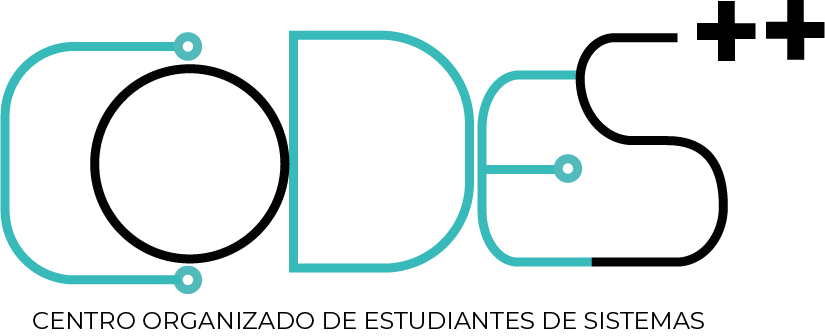

<p align="center">
  <picture>
    <source media="(prefers-color-scheme: dark)" srcset="./src/assets/logo-dark.png" />
    
  </picture>
</p>

<h1 align="center">Wiki CODES</h1>

<p align="center"><strong>Con ❤️, para entender la UNLu más fácil.</strong></p>

<p align="center">
  <a href="https://starlight.astro.build"></a>
  <a href="https://github.com/CODES-UNLU/Wiki-Codes/actions/workflows/deploy.yml"></a>
  
</p>

---

## 🧭 ¿Qué es Wiki CODES?

**Wiki CODES** es una wiki **hecha por y para estudiantes** de la Universidad Nacional de Luján (UNLu).
Reúne en un solo lugar, y en español, todo lo que necesitás para estudiar, organizarte y aprovechar
la facultad: desde material de las materias hasta beneficios que podés solicitar.

Nace del **Centro Organizado de Estudiantes de Sistemas (CODES++)** con una idea simple: que la
información deje de estar dispersa y que la construyamos entre todos.

> 💚 **Con amor, para entender la UNLu más fácil.**

## 📚 ¿Qué vas a encontrar?

| Sección | Qué incluye |
| --- | --- |
| 🎓 **Recursos de la UNLu** | Calendario académico, trámites, servicios y material general para estudiantes. |
| 💻 **Licenciatura en Sistemas** | Plan de estudios, correlatividades y material por materia de la carrera. |
| 🚀 **Informática** | Herramientas, artículos y proyectos interesantes de informática y sistemas. |
| 🤝 **Beneficios educativos** | Becas, programas y beneficios que podés solicitar como estudiante. |

> ¿Falta algo o algo está desactualizado? Se arregla colaborando: mirá [cómo colaborar](#-cómo-colaborar).

## 🧩 Tecnologías

- [Astro](https://astro.build) — el framework del sitio.
- [Starlight](https://starlight.astro.build) — el tema de documentación.
- [Lucode Starlight](https://github.com/lucas-labs/lucode-starlight-theme) — el estilo visual (inspirado en shadcn/ui).
- [pnpm](https://pnpm.io) — el gestor de paquetes.

El sitio se publica automáticamente en **GitHub Pages** con cada push a `master`.

## 🗂️ Estructura del proyecto

```
.
├─ public/               # Íconos y archivos estáticos (favicon, etc.)
├─ src/
│  ├─ assets/            # Logos e imágenes
│  ├─ content/docs/      # El contenido de la wiki (Markdown / MDX)
│  │  ├─ index.mdx       # Página de inicio
│  │  ├─ unlu/           # Recursos de la UNLu
│  │  ├─ sistemas/       # Licenciatura en Sistemas
│  │  └─ informatica/    # Informática
│  ├─ styles/custom.css  # Colores y ajustes de la marca CODES
│  └─ content.config.ts
├─ astro.config.mjs      # Configuración del sitio
└─ package.json
```

El contenido se escribe en archivos `.md` o `.mdx` dentro de `src/content/docs/`: cada archivo se
convierte en una página del sitio.

## 🛠️ Desarrollo local

Requisitos: [Node.js](https://nodejs.org) 20+ y [pnpm](https://pnpm.io).

```bash
pnpm install   # Instalar dependencias
pnpm dev       # Servidor local en http://localhost:4321/Wiki-Codes/
pnpm build     # Generar el sitio en ./dist
pnpm preview   # Previsualizar el build
```

| Comando | Para qué sirve |
| --- | --- |
| `pnpm install` | Instala las dependencias. |
| `pnpm dev` | Levanta el servidor de desarrollo. |
| `pnpm build` | Compila el sitio para producción. |
| `pnpm preview` | Previsualiza el sitio compilado. |
| `pnpm astro ...` | Ejecuta comandos del CLI de Astro. |

> ⚠️ Antes de subir cambios, **siempre** corré `pnpm build` y confirmá que no haya errores.

## 🤝 ¿Cómo colaborar?

La wiki crece con aportes de la comunidad. Sumar material, corregir errores o proponer secciones
nuevas es más que bienvenido.

1. Leé la [guía de contribución](CONTRIBUTING.md).
2. Hacé tu cambio siguiendo las **Conventional Commits en español**.
3. Validá el build con `pnpm build`.
4. Abrí un Pull Request. 🎉

Este proyecto sigue un [Código de Conducta](CODE_OF_CONDUCT.md): un espacio respetuoso y amable
para todas las personas.

## 💬 Comunidad

- 🌐 Web del centro: [codesunlu.tech](https://www.codesunlu.tech/)
- 💬 Discord: [discord.gg/2hbjvN7KDH](https://discord.gg/2hbjvN7KDH)
- 🐙 GitHub: [CODES-UNLU](https://github.com/CODES-UNLU)

## 📄 Licencia

Este proyecto es de **CODES++** y se distribuye bajo la licencia [MIT](LICENSE).

---

<p align="center">Hecho con ❤️ por y para estudiantes de Sistemas de la UNLu.</p>
